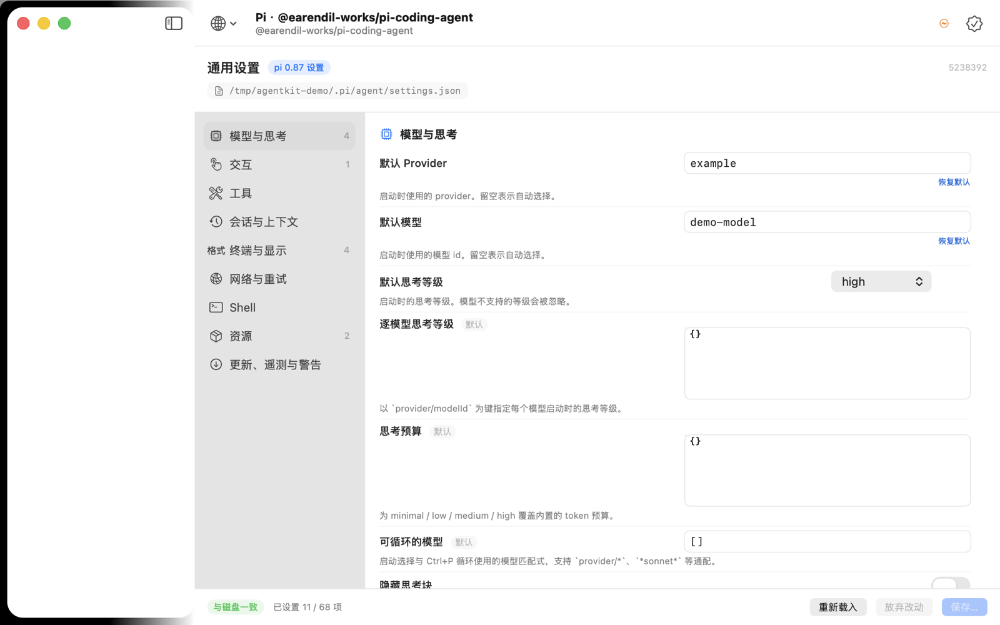
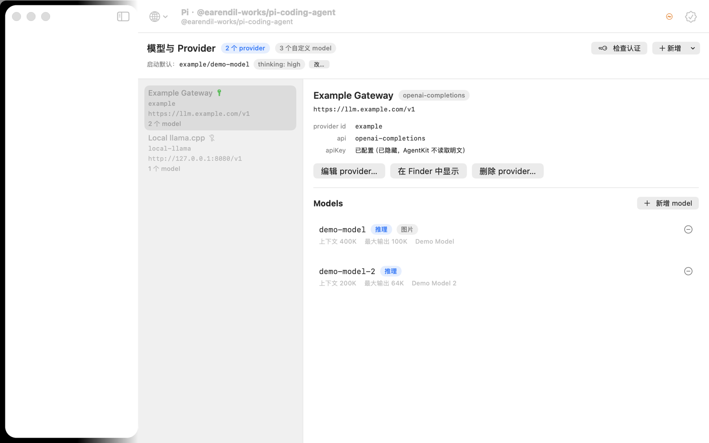
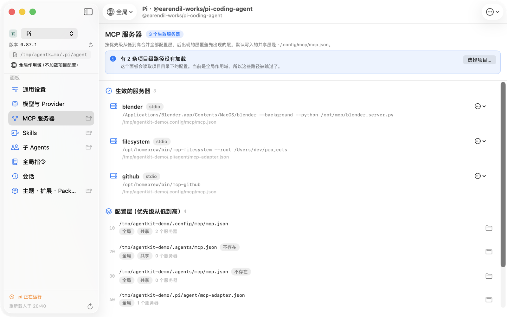
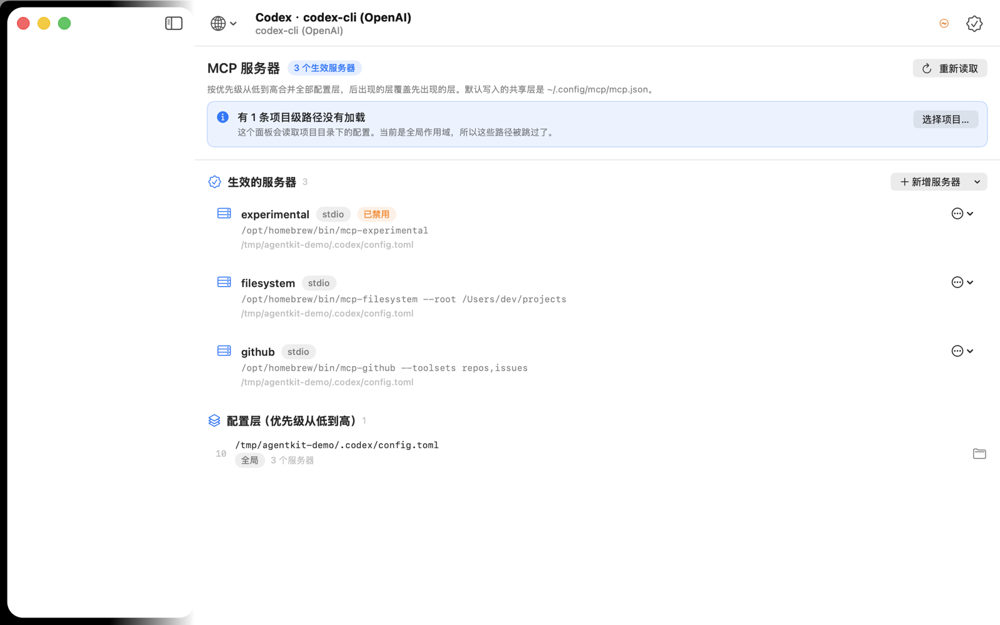
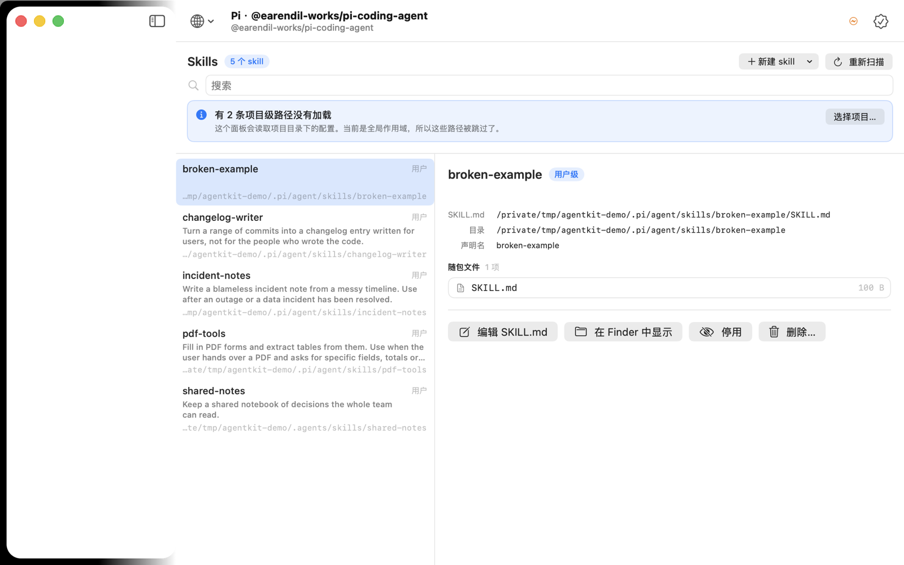
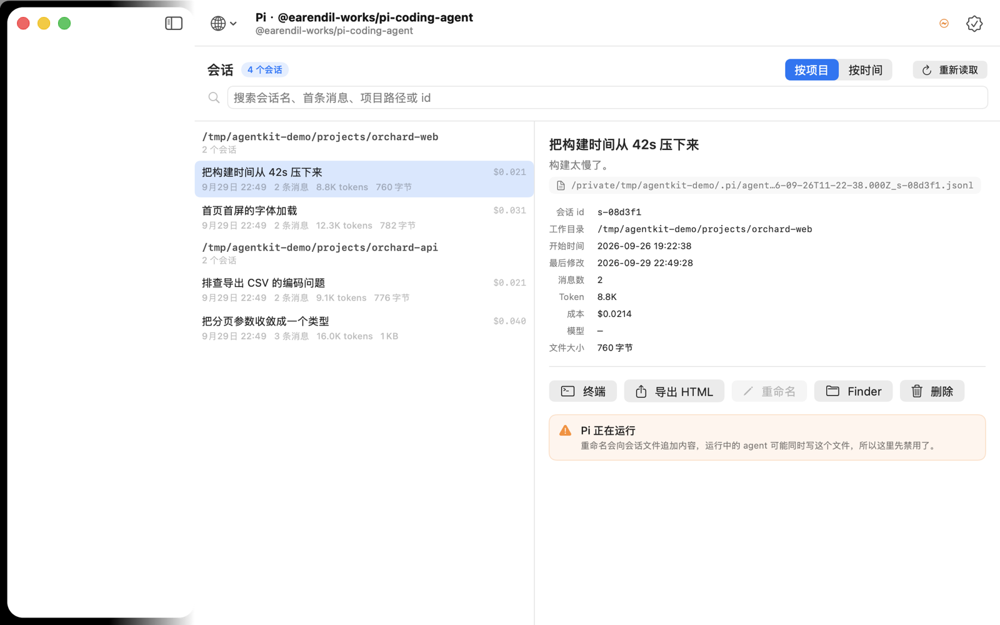
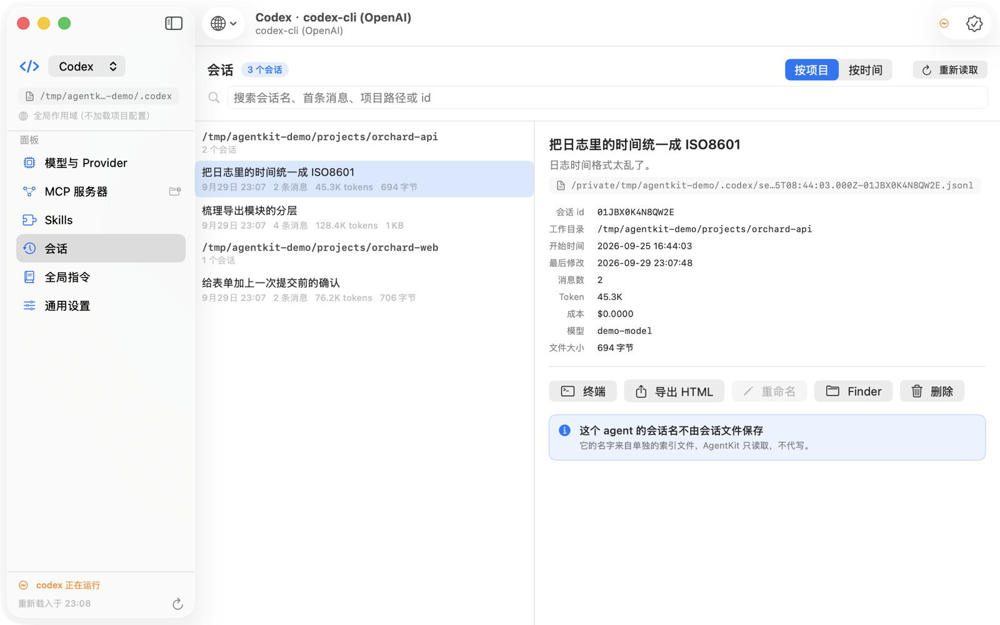
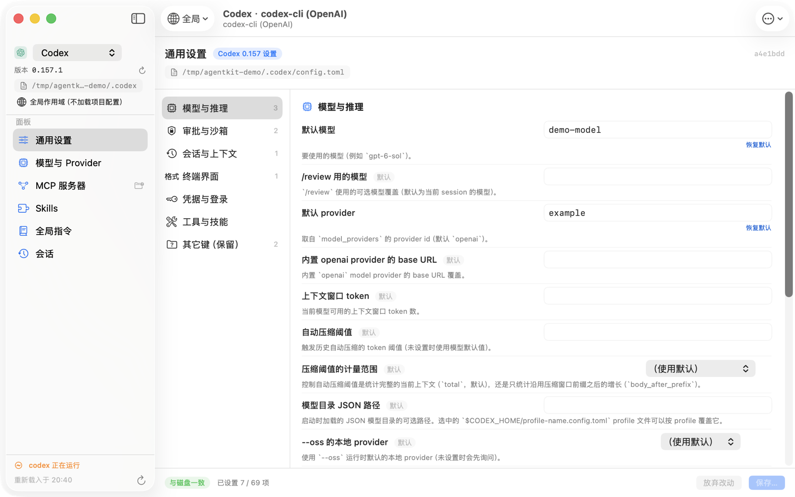
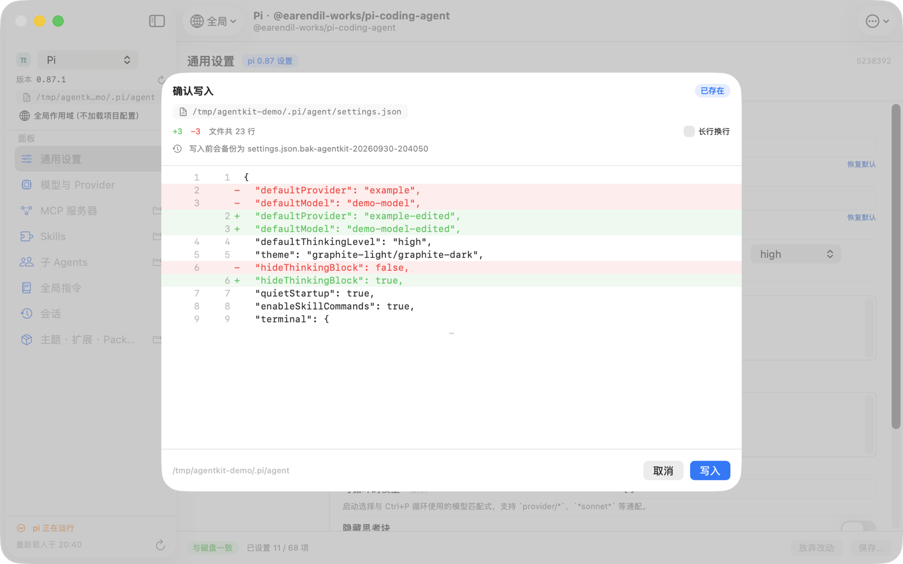

# AgentKit

一个原生 macOS GUI，用来配置和管理本地的 coding agent。

现在支持两个 agent：

| Agent | 配置根 | 覆盖的面板 |
|---|---|---|
| **pi**（`@earendil-works/pi-coding-agent`） | `~/.pi/agent` | 模型与 Provider、MCP、Skills、会话、全局指令、子 Agents、通用设置、主题/扩展/Packages |
| **Codex**（`codex-cli`） | `~/.codex` | 模型与 Provider、MCP、Skills、会话、全局指令、通用设置 |

**支持哪个 agent 由一份 JSON 描述文件决定** —— 加一个新 agent = 加一个 JSON，不改代码。



---

## 为什么是描述文件驱动的

本地 coding agent 的配置从来不是"一个文件"。同样是"模型配置"，两个 agent 就长得完全不一样：

| 配置面 | pi | Codex |
|---|---|---|
| 格式 | JSON | **TOML**（`config.toml`） |
| provider 容器 | `providers` | `model_providers` |
| 字段拼写 | `baseUrl` / `api` / `apiKey` | `base_url` / `wire_api` / `env_key` |
| MCP 容器 | `mcpServers`（多文件分层） | `mcp_servers`（单文件） |
| 服务器开关 | `disabled = true` | `enabled = false`（**极性相反**） |
| 会话布局 | `sessions/<cwd 分组>/<时间戳>.jsonl` | `sessions/<年>/<月>/<日>/rollout-*.jsonl` |
| 会话字段 | 顶层 `id` / `cwd` | 全部嵌在 `payload` 下 |
| 会话名 | 文件里的 `session_info` 记录 | 单独的 `session_index.jsonl` |
| token 统计 | 每条消息的 `usage`（求和） | `event_msg` 里的累计值（取最后一个） |

把这些硬编码进一个 App，等于每支持一个新 agent 就重写一遍。AgentKit 的做法是：

- **描述文件（数据）** 声明路径、层次、字段名、形状；
- **面板处理器（代码）** 是一组有限且封闭的文件形状：`typed-json`、`providers-map`、
  `mcp-servers-map`、`skill-dirs`、`jsonl-sessions`、`md-frontmatter`、`md`；
- 描述文件引用到本版本不认识的 `kind`，那个面板降级成占位符，**其它面板照常可用，不崩**。

内置描述文件：[`Resources/Agents/pi.json`](Resources/Agents/pi.json)、
[`Resources/Agents/codex.json`](Resources/Agents/codex.json)。

---

## 快速开始

```bash
./build.sh          # 编译到 out/AgentKit.app（只需要 swiftc）
./install.sh        # 再复制到 /Applications/AgentKit.app 并提示入口
./run-tests.sh      # 480 项离线断言，不需要窗口、不需要网络
```

要求：macOS 14+、Xcode 命令行工具（Swift 6.x）、一个用于签名的 Apple Development
证书（可用 `AGENTKIT_SIGN_IDENTITY` 覆盖）。

打开方式：

```bash
open -a AgentKit
AGENTKIT_OPEN=codex/mcp open -a AgentKit              # 直接进某个 agent 的某个面板
AGENTKIT_PROJECT=~/code/my-repo open -a AgentKit      # 指定项目作用域
CODEX_HOME=/tmp/fixture open -a AgentKit              # 换一个配置根（夹具优先调试）
```

### 项目作用域

描述文件里有八条 `$CWD` 路径（项目的 MCP 层、 `.pi/skills`、`.pi/agents`、
`.codex/config.toml` …）。**不选项目它们就全部不加载**，而静默消失是最糟的选项 ——
看起来像项目配错了。所以：

- 工具栏左边的文件夹菜单选项目，最近用过的和 agent 会话历史里出现过的目录都在里面；
- 侧边栏显示当前作用域，点一下回到全局；
- 没选项目时，受影响的每个面板顶部都会写明"有 N 条项目级路径没有加载"，并给一个选择按钮。

会话历史里的目录是**从会话 header 的 `cwd` 读出来的**，不是从目录名反推的：pi 把路径里的
`/` 换成 `-` 存成 slug，而真实目录名里可能本来就有连字符，反解会出错。

---

## 面板

### 模型与 Provider



从描述文件声明的容器里读 provider 与 model。字段名按各 agent 的拼写走（pi 的
`baseUrl`、Codex 的 `base_url`），`apiKey` **只显示"已配置/未配置"**：AgentKit 从不
读取、显示或记录密钥明文。pi 走 `pi auth check --provider X --json --no-refresh` 检查
认证；Codex 没有等价的子命令，就不显示这个按钮。编辑 provider 是**合并**而不是替换，
`compat`、`requires_openai_auth` 这类 AgentKit 不认识的键原样保留。

MCP 服务器编辑器同理：它只改表单上那四个字段，`env`、`cwd`、`type`、
`startup_timeout_sec` 之类一律原样留着 —— 用表单重建整个条目会把这些悄悄删掉。
什么都没改时它显示"没有改动。"并且写入按钮是灰的。

### MCP 服务器



按优先级合并全部配置层，标出每个服务器的来源层与被覆盖的层。

对 pi，它还会指出"看起来配好了其实已经死了"的文件 —— 例如本机真实存在过的情况：

```
/Users/dev/.pi/agent/mcp.json 已经不会被读取
pi-mcp-adapter 已经不再读取这个文件：生效的是 ~/.config/mcp/mcp.json（共享全局层）。
```

一键修复是一个**分步计划**（迁移 adapter 专属键 → 并入服务器 → 重命名旧文件），
每一步的 diff 都展示在确认页里，任何一步失败就停下。上图是本机的真实案例（已修复）：
`imports` 迁到了 `mcp-adapter.json`，`mcpServers` 并入共享全局层，死文件改名为
`mcp.json.bak-agentkit-*`。之后诊断徽标消失（见 `docs/mcp-after.png`）。

对 Codex，服务器来自 `[mcp_servers.*]`，并且**开关极性按 Codex 的约定**：
`enabled = false` 显示为「已禁用」。



### Skills



递归查找 `SKILL.md`，**穿过符号链接**（一个链接到别处仓库的 skill 目录也能正常列出），同时剪掉 `.git` / `node_modules` / `.venv` / `logs` 这类目录并限制
深度。校验规则对齐规范：缺 `description` 即"不会被加载"，`name` 必须符合 Agent
Skills 规范。

### 会话



列表只用每个文件的**第一行**（header），消息数 / token / 成本由后台流式统计并按
`(大小, mtime)` 缓存，所以 上百个会话都能秒开 —— 尽管 Codex
的单文件能到 88 MB。支持搜索、按项目或按时间分组、在终端恢复、导出 HTML、重命名、
移到废纸篓。



Codex 的名字来自 `session_index.jsonl`，AgentKit **只读取不代写**，所以那个面板里
「重命名」是禁用的，并且说明了原因。

### 全局指令 / 子 Agents / 通用设置 / 主题 · 扩展



- **全局指令**：Markdown 编辑 + 预览，列出 override / instructions / SYSTEM / APPEND_SYSTEM
  的生效关系，并从项目目录向上发现沿途命中的 `AGENTS.md`。
- **子 Agents**（仅 pi）：frontmatter 表单（name / description / model / tools）+ 正文编辑，
  `model` 会对着当前模型列表校验；`tools: read, grep` 这种逗号写法原样保留。
- **通用设置**：按官方文档逐键生成的表单，含类型、枚举、范围与默认值。pi 的字段表
  完全按其中文文档编写；Codex 的 69 项取自[上游配置参考](https://developers.openai.com/codex/config-reference)，
  **标签是中文、说明保留上游英文原文**，方便逐条对照而不是信任翻译。未收录的键
  （比如 Codex 的 `mcp_servers`、`model_providers`，它们有自己的面板）进入只读的
  「其它键（保留）」区，写入时原样保留。
- **主题 · 扩展 / Packages**（仅 pi）：沿用 `.off` 后缀约定做启用/停用。

---

## 写入安全

这是这个工具最不能出错的地方，所以所有写入都收敛到同一条路径：

1. **读**：记下 `(大小, mtime, sha256)`。解析失败 → 该文件全部编辑入口禁用，
   只提供原文视图与外部编辑器，**绝不覆盖**。
2. **改**：在保序、保留未知键的树上做点号路径合并。
3. **写**：先把改动渲染成文本，再走同目录临时文件 → `fsync` → `rename` 原子替换，
   并保留原文件权限（`models.json` / `auth.json` / `config.toml` 是 0600，写回后仍是 0600）。
4. **外科式修改**：改动只有一个或多个叶子值时，AgentKit 把新字面量**拼接进原始字节**，
   不改动任何没碰过的行 —— 包括注释，也包括你自己写成一行的那种内联表/内联对象。
5. **备份**：写入前在同目录生成 `<文件>.bak-agentkit-YYYYMMDD-HHMMSS`，每个文件保留 10 份。
6. **确认**：任何写入都先弹 diff，确认才落盘。

   

7. **并发**：落盘前比对 sha256，不一致就中止并提示"文件已被外部（很可能是 agent）改动"。
8. **运行中提示**：检测到 agent CLI 在跑就提示改动需要 `/reload` 或重启；会话重命名
   这类会改写进行中文件的动作直接禁用。
9. **护栏**：解析后的写入路径必须落在描述文件声明的 `scopeGuard` 内。

### 结构改动按格式分级

| 改动 | JSON | TOML |
|---|---|---|
| 改一个值 | 按字节替换那一处 | 同左，注释与内联表全保留 |
| 表里加/删一个键 | 整份重写（JSON 没有注释，无损） | **只重排那一张表**，其它表逐字节不动 |
| 新增一张表 | 整份重写 | **追加新块**，原文件不动 |
| 顶层增删键 | 整份重写 | 整份按标准格式重写，**确认页会明确提示注释会丢失** |

确认页只在真的有损时才给警告 —— 纯追加一张表不会报警。

### 夹具优先

开发与验收都先对着副本跑，确认无误再碰真实配置：

```bash
rsync -a ~/.pi/agent/ /tmp/fixture/agent/
PI_CODING_AGENT_DIR=/tmp/fixture/agent ./out/AgentKit.app/Contents/MacOS/AgentKit

rsync -a ~/.codex/ /tmp/fixture/codex/ --exclude '*.sqlite*'
CODEX_HOME=/tmp/fixture/codex ./out/AgentKit.app/Contents/MacOS/AgentKit
```

---

## 描述文件

放在 `~/.config/agentkit/agents/*.json`（可用 `AGENTKIT_CONFIG_DIR` 覆盖）。
`id` 与内置相同的会**整体覆盖**内置那一份，侧边栏会标「自定义描述」。

```jsonc
{
  "descriptorVersion": 1,
  "id": "codex",
  "name": "Codex",
  "icon": "chevron.left.forwardslash.chevron.right",

  "root": { "env": "CODEX_HOME", "default": "~/.codex" },
  "detect": {
    "paths": ["~/.codex"],
    "cli": { "name": "codex", "loginShellLookup": true,
             "candidates": ["~/.nvm/versions/node/*/bin/codex", "/opt/homebrew/bin/codex"] }
  },

  "write": { "backup": { "suffix": ".bak-agentkit", "keep": 10 },
             "scopeGuard": ["$ROOT", "$HOME", "/tmp"] },

  "surfaces": [
    { "id": "settings", "kind": "settings", "title": "通用设置",
      "file": "$ROOT/config.toml", "format": "toml", "schema": "codex-0.157" },

    { "id": "mcp", "kind": "mcp", "title": "MCP 服务器", "format": "toml",
      "serverKey": "mcp_servers",           // 容器名
      "toggleKey": "enabled",               // 开关叫 enabled
      "toggleDisabledValue": false,         // 而且 false 才表示停用
      "layers": [ { "path": "$ROOT/config.toml", "precedence": 10, "writable": true } ] },

    { "id": "sessions", "kind": "sessions", "title": "会话",
      "root": "$ROOT/sessions",
      "sessions": {
        "recursive": true,                  // sessions/年/月/日/
        "headerType": "session_meta",
        "header": { "id": "payload.id", "cwd": "payload.cwd", "timestamp": "timestamp" },
        "index": { "file": "$ROOT/session_index.jsonl", "key": "id", "value": "thread_name" },
        "message": { "type": "response_item", "payload": "payload",
                     "role": "role", "text": "content" } } }
  ]
}
```

路径 token：`~`、`$ROOT`（agent 根）、`$CWD`（当前项目）、`$APP`（AgentKit 支持目录）、
`$HOME`。`*` 只允许出现在 `cli.candidates`，并且按版本号取最高的那个。

`format` 不写就按扩展名判断（`.toml` → TOML，其余 JSON）。

### 加一个新 agent 的步骤

1. 复制 `Resources/Agents/pi.json` 或 `codex.json`；
2. 改 `id` / `name` / `root`；
3. 按目标 agent 的真实文件结构调整各面板的路径与字段名；
4. 丢进 `~/.config/agentkit/agents/`，重启 App。

不需要重新编译。`settings` 面板的 `schema` 指向一份**内置的强类型字段表**；如果目标
agent 没有对应的 schema，那个面板会显示"找不到 schema"并降级，其它面板照常。

写坏了不会崩：侧边栏会给出解析失败的原因，其它 agent 照常可用。

---

## 环境变量

| 变量 | 作用 |
|---|---|
| `PI_CODING_AGENT_DIR` | 覆盖 pi 的配置根（pi 描述文件里 `root.env` 声明） |
| `CODEX_HOME` | 覆盖 Codex 的配置根 |
| `AGENTKIT_CONFIG_DIR` | 覆盖描述文件目录（默认 `~/.config/agentkit`） |
| `AGENTKIT_OPEN=codex/mcp` | 启动直接进指定 agent 的指定面板 |
| `AGENTKIT_PROJECT=~/repo` | 指定项目作用域（等价于在工具栏里选项目） |
| `AGENTKIT_SIGN_IDENTITY` | 构建时指定签名身份 |
| `AGENTKIT_TARGET` | 构建目标三元组，默认 `arm64-apple-macosx14.0` |

日志：

```bash
log show --last 5m --info --predicate 'subsystem == "com.allengzc.agentkit"'
```

---

## 已知限制

- **项目作用域要手动选**：GUI 程序没有"当前工作目录"这种有意义的默认值，所以 AgentKit
  不去猜，而是在工具栏让你选，并把没加载的路径数写在面板上。
- **内置两个 agent**（pi 与 Codex）。架构为其它 agent 留好了接口，但描述文件只是数据 ——
  如果目标 agent 用了第三种配置格式（YAML / INI），需要先给 Core 加一个解析器。
- **TOML 的结构性改动不是逐字节的**：只重排受影响的表，其它表不动；顶层增删键会整份
  按标准格式重写，此时注释会丢失，确认页会明确提示。
- **Skills 的启用/停用是 AgentKit 自己的约定**（把目录移到同级 `.disabled/`），
  因为 pi 没有单个 skill 的开关，只有全局的 `enableSkillCommands`。界面里写明了这一点。
- **不接管密钥**：`apiKey` / `env_key` / `auth.json` 一律只做掩码显示。
- **Codex 的会话重命名不支持**：它的名字存在单独的索引文件里，AgentKit 不代写。
- **Codex 的 settings 字段表覆盖 69 项**（模型、审批、沙盒、终端、凭据、工具）；
  `features.*`、`mcp_servers.*`、`model_providers.*` 等宽表键落在只读的
  「其它键（保留）」里，原样保留但不在这里编辑。
- **Packages 只读**：`settings.packages` 的增删请用 `pi install` / `pi remove`。
- **不做 schema 漂移自动合并**：agent 升级后新增的键会落到"其它键（保留）"里，
  AgentKit 不会猜它的含义。
- App 不做沙盒（必须读写 `~/.pi`、`~/.codex`、`~/.config`、`~/.agents` 并拉起终端）；
  项目目录落在 `~/Documents`、`~/Desktop`、`~/Downloads` 时首次访问会触发系统授权弹窗。

---

## 目录结构

```
Sources/Core/        JSON/TOML 树与无损读写、按字节拼接与表级修补、路径解析、
                     描述文件、Markdown/frontmatter、进程
Sources/Surfaces/    各面板的纯逻辑（无 UI）：MCP 合并、会话解析、skills 扫描、设置 schema
Sources/App/         状态、项目作用域、写入控制器、Finder/终端动作
Sources/Views/       SwiftUI 界面
Resources/Agents/    内置描述文件（pi.json、codex.json）
Tests/main.swift     480 项离线断言
```

## License

MIT © 2026 allengzc
