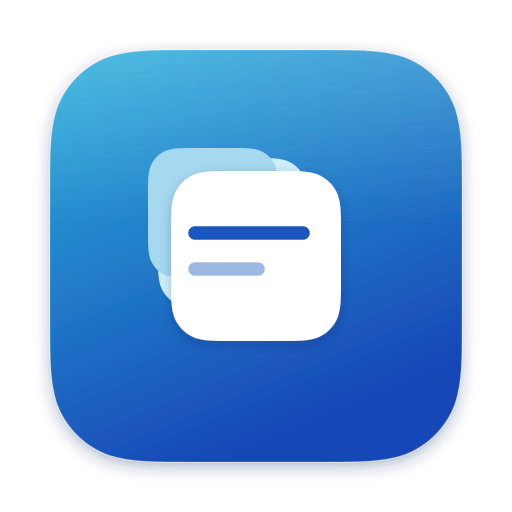

# 开发与验收

给贡献者的：构建、断言、夹具、图标与截图流水线。使用者入口是 [README](../README.md)；
规矩在[根 `AGENTS.md`](../AGENTS.md) 和各目录自己的 `AGENTS.md` 里，这一页只讲**怎么做**。

---

## 开工前

```bash
./run-tests.sh      # 全部离线断言，先跑它建基线
./build.sh          # swiftc → out/AgentKit.app
./install.sh        # 再拷到 /Applications
```

要求：macOS 14+、Xcode 命令行工具（Swift 6.x）、一个用于签名的 Apple Development
证书（可用 `AGENTKIT_SIGN_IDENTITY` 覆盖）。构建目标三元组默认
`arm64-apple-macosx14.0`，可用 `AGENTKIT_TARGET` 覆盖。

**任何写操作先对着夹具跑**，别拿真实配置试（下一节）。

---

## 夹具优先

```bash
python3 Tools/make-demo.py                      # 全假配置 → /tmp/agentkit-demo
AGENTKIT_HOME=/tmp/agentkit-demo ./out/AgentKit.app/Contents/MacOS/AgentKit
```

`AGENTKIT_HOME` 让整个 App 把 `~` / `$HOME` 解析到那棵树 —— 这是**产品功能**，
不是测试特权。

镜像真实配置时也先在副本上跑，确认无误再碰真东西：

```bash
rsync -a ~/.pi/agent/ /tmp/fixture/agent/
PI_CODING_AGENT_DIR=/tmp/fixture/agent ./out/AgentKit.app/Contents/MacOS/AgentKit

rsync -a ~/.codex/ /tmp/fixture/codex/ --exclude '*.sqlite*'
CODEX_HOME=/tmp/fixture/codex ./out/AgentKit.app/Contents/MacOS/AgentKit
```

---

## 断言

`./run-tests.sh` 离线跑完全部断言，不需要窗口、不需要网络。它把 `Sources/Core`、
`Sources/Surfaces` 和 `Sources/App/JSONEditController.swift`、`ProjectStore.swift`
编到一起跑 `Tests/main.swift` —— 唯一写盘入口就在这条链路上，所以写盘保证是被断言
覆盖的，而不是靠人肉复现。

断言数随开发增长（根 `AGENTS.md` 记为 590 项），**以脚本打印的输出为准**。
怎么写断言、边界放哪，见 [`Tests/AGENTS.md`](../Tests/AGENTS.md)。

---

## 截图流水线

```bash
./Tools/make-screenshots.sh              # 全部重出
./Tools/make-screenshots.sh skills mcp   # 只重出这几个
```

一切从 `Tools/make-demo.py` 造的假配置渲染而来：provider、会话、skill、项目路径全是
编的，`AGENTKIT_HOME` 让 App 只在夹具树里解析 `~`，所以**不读任何真实配置**。
截图只能来自夹具 —— 仓库里不许有真实数据，这条踩过一次（`docs/` 下 13 张截图拍的是
真实配置，进了 git 历史，后来用 `filter-branch` 重写才清掉）。

几个坑记在脚本里，改之前值得读：

- **不能让 App 自己渲染视图层级**：`CALayer.render(in:)` 看起来更省事（不要录屏权限、
  不需要窗口在前台），但它会**静默丢掉侧边栏** —— 侧边栏是窗口服务器合成的
  `NSVisualEffectView`。出来的是一张非常有说服力的、左列全空的截图。
- **`windowid -o` 会列出已经退出的实例的窗口**，可能拍到上一次运行正在死的窗口；
  所以实例是串行的，而且只用 on-screen 窗口。
- **显示器必须醒着**：睡着时每个窗口截取都失败，全屏截取只会返回一张陈旧的空白帧。

验收不看眼睛。侧边栏是截取最容易丢掉的部分，所以脚本会把它裁下来量字节：
空白的左列压缩后几乎没有体积。这条规矩（"改完 UI 必须渲染出来看，并且让机器验收"）
的由来见 [`Sources/Views/AGENTS.md`](../Sources/Views/AGENTS.md)。

---

## 图标



三张配置文件卡片向左上退去，最前面那张带两行键值 —— 一个形状说清这个产品在做什么：
好几种不同形状的配置文件，被摆成一个界面。

`Resources/Icon.svg` 是数据源，`Resources/AppIcon.icns` 是包里真正用的那份。
两者都由 `Tools/make-icon.py` 生成：

```bash
python3 Tools/make-icon.py     # 重新生成 Icon.svg / Icon-simple.svg / AppIcon.icns
```

几个刻意的决定：

- **圆角不是圆角矩形**。macOS 11 起用的是连续曲率圆角，形状由
  `RoundedRectangle(style: .continuous)` 决定。`Tools/iconpath.swift` 直接问系统要
  那条路径再转成 SVG，而不是手搓贝塞尔去逼近 —— 这样它的轮廓和 Dock 里其它图标是一致的。
  画布 1024、贴片 824、圆角 185.4、居中留出阴影空间，都是 Apple 的栅格。
- **后面两张卡是不透明浅色，不是半透明白**。白色 50% 叠在饱和蓝上会变成淡蓝，
  一叠淡蓝读起来像雾或者运动模糊，而不像几张分开的纸。
- **16 和 32 点用简化版**（`Icon-simple.svg`）：那个尺寸下后排卡片和两行字都是亚像素，
  留着只会把轮廓搅浑。同一个剪影、同一个色，只留一张卡。
- **所有尺寸都是算出来的**，十个 PNG 一次生成，不需要手工导出。

生成的产物不许手改，改脚本重跑 —— 见 [`Tools/AGENTS.md`](../Tools/AGENTS.md)。

---

## 目录结构

```
Sources/Core/        JSON/TOML 树与无损读写、按字节拼接与表级修补、路径解析、
                     描述文件、Markdown/frontmatter、进程
Sources/Surfaces/    各面板的纯逻辑（无 UI）：MCP 合并、会话解析、skills 扫描、设置 schema
Sources/App/         状态、项目作用域、写入控制器、Finder/终端动作
Sources/Views/       SwiftUI 界面（Panes/ 每个面板一个文件）
Resources/Agents/    内置描述文件（pi.json、codex.json、claude.json）
Resources/Icon.svg   图标数据源（AppIcon.icns 由它生成）
Tools/               构建与验证小工具、夹具生成器、截图脚本
Tests/main.swift     全部离线断言
docs/                截图（全部由夹具生成）与本页这些专题文档
```

改哪个面板就改 `Sources/Views/Panes/<名字>Pane.swift` + 对应的
`Sources/Surfaces/<名字>Surface.swift`。**新面板先写 Surface 和它的断言，再接 View。**
每个目录的 `AGENTS.md` 是该目录的规则，根 `AGENTS.md` 是索引。

---

## 日志

```bash
log show --last 5m --info --predicate 'subsystem == "com.allengzc.agentkit"'
```

---

## 环境变量

`AGENTKIT_HOME`、`AGENTKIT_OPEN`、`AGENTKIT_PROJECT`、`AGENTKIT_DOC_STATE`、
`AGENTKIT_CONFIG_DIR`、`AGENTKIT_SIGN_IDENTITY`、`AGENTKIT_TARGET`、
`PI_CODING_AGENT_DIR`、`CODEX_HOME` 的完整表在 [README](../README.md#环境变量)。
