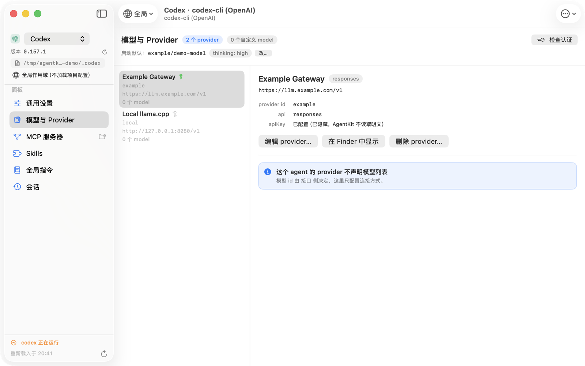
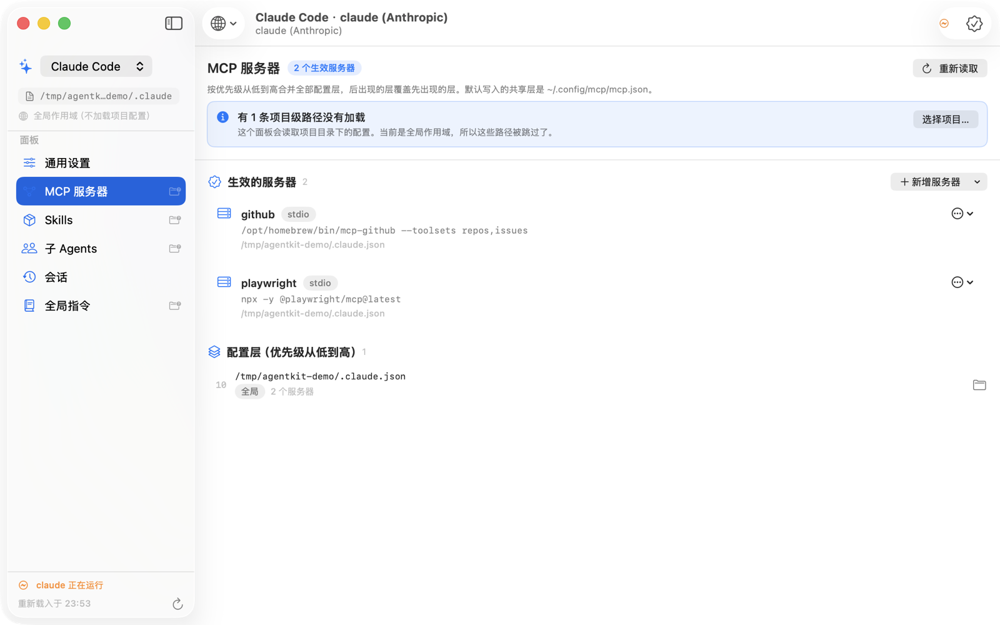
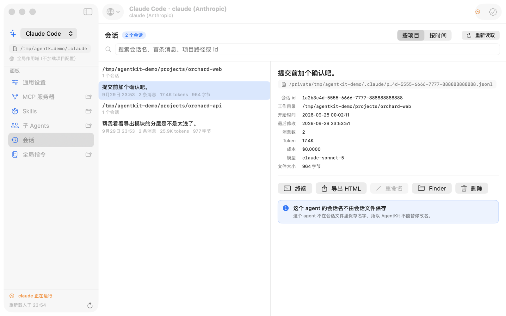
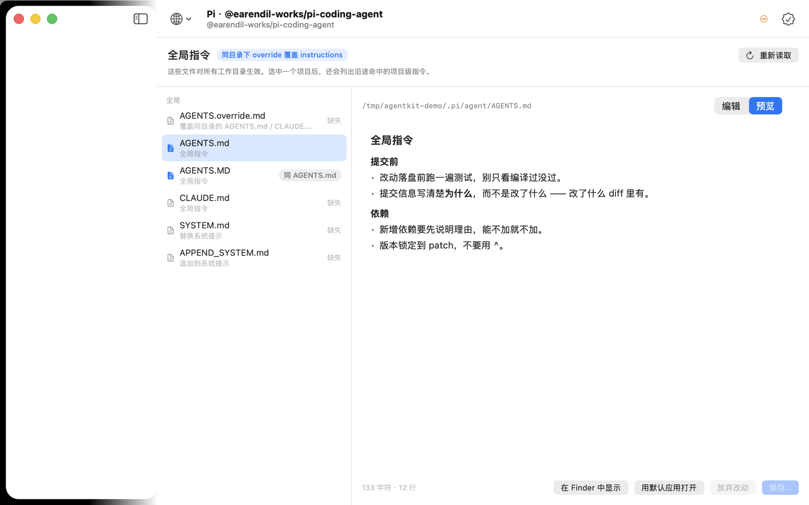
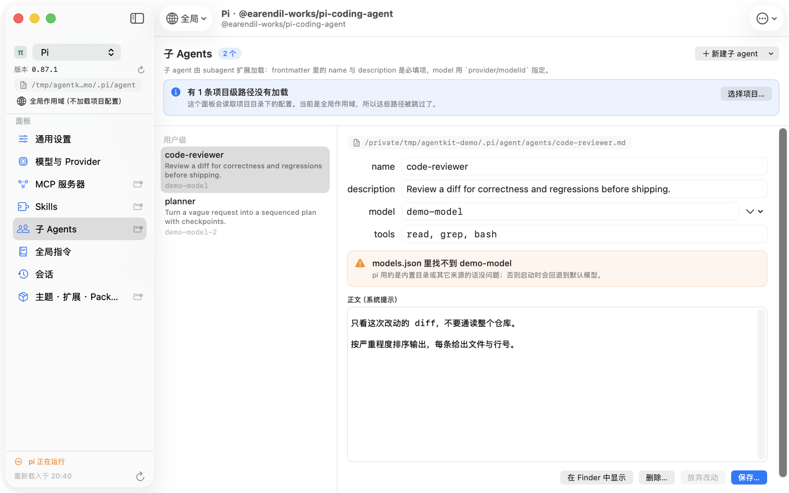
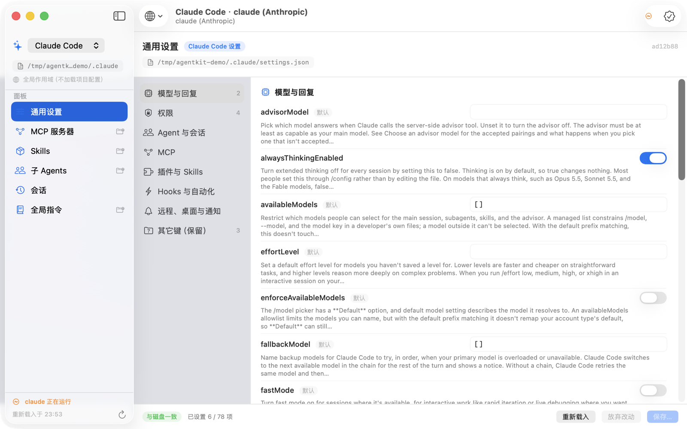

# 面板

八个面板各自的细节。回到 [README](../README.md)。

面板不是按 agent 硬编码的：每个面板声明它要读的文件形状与字段名，由
[描述文件](descriptors.md) 提供 —— 所以同一个面板在 pi / Codex / Claude Code 上
长得一样、只看配置不同。

| # | 面板 | pi | Codex | Claude Code |
|---|---|---|---|---|
| 1 | [模型与 Provider](#模型与-provider) | ✅ | ✅ | — |
| 2 | [MCP 服务器](#mcp-服务器) | ✅ | ✅ | ✅（无开关） |
| 3 | [Skills](#skills) | ✅ | ✅ | ✅ |
| 4 | [会话](#会话) | ✅ | ✅（不能改名） | ✅ |
| 5 | [全局指令](#全局指令) | ✅ | ✅ | ✅ |
| 6 | [子 Agents](#子-agents) | ✅ | — | ✅ |
| 7 | [通用设置](#通用设置) | ✅ | ✅ | ✅ |
| 8 | [主题与扩展（Packages）](#主题与扩展packages) | ✅ | — | — |

---

## 项目作用域

描述文件里有八条 `$CWD` 路径（项目的 MCP 层、`.pi/skills`、`.pi/agents`、
`.codex/config.toml` …）。**不选项目它们就全部不加载**，而静默消失是最糟的选项 ——
看起来像项目配错了。所以：

- 工具栏左边的文件夹菜单选项目，最近用过的和 agent 会话历史里出现过的目录都在里面；
- 侧边栏显示当前作用域，点一下回到全局；
- 没选项目时，受影响的每个面板顶部都会写明"有 N 条项目级路径没有加载"，并给一个选择按钮。

会话历史里的目录是**从会话 header 的 `cwd` 读出来的**，不是从目录名反推的：pi 把路径里的
`/` 换成 `-` 存成 slug，而真实目录名里可能本来就有连字符，反解会出错。

---

## 模型与 Provider


从描述文件声明的容器里读 provider 与 model。字段名按各 agent 的拼写走（pi 的
`baseUrl`、Codex 的 `base_url`），`apiKey` **只显示"已配置/未配置"**：AgentKit 从不
读取、显示或记录密钥明文。pi 走 `pi auth check --provider X --json --no-refresh` 检查
认证；Codex 没有等价的子命令，就不显示这个按钮。编辑 provider 是**合并**而不是替换，
`compat`、`requires_openai_auth` 这类 AgentKit 不认识的键原样保留。



MCP 服务器编辑器同理：它只改表单上那四个字段，`env`、`cwd`、`type`、
`startup_timeout_sec` 之类一律原样留着 —— 用表单重建整个条目会把这些悄悄删掉。
什么都没改时它显示"没有改动。"并且写入按钮是灰的。

---

## MCP 服务器


按优先级合并全部配置层，标出每个服务器的来源层与被覆盖的层。

对 pi，它还会指出"看起来配好了其实已经死了"的文件 —— 例如本机真实存在过的情况：

```
~/.pi/agent/mcp.json 已经不会被读取
pi-mcp-adapter 已经不再读取这个文件：生效的是 ~/.config/mcp/mcp.json（共享全局层）。
```

一键修复是一个**分步计划**（迁移 adapter 专属键 → 并入服务器 → 重命名旧文件），
每一步的 diff 都展示在确认页里，任何一步失败就停下。修复会把 `imports` 迁到
`mcp-adapter.json`，把 `mcpServers` 并入共享全局层，并把死文件改名为
`mcp.json.bak-agentkit-*`，之后诊断徽标消失。

对 Codex，服务器来自 `[mcp_servers.*]`，并且**开关极性按 Codex 的约定**：
`enabled = false` 显示为「已禁用」。


对 Claude Code，服务器在 `~/.claude.json` 里。**这个面板没有开关**：claude 用
`disabledMcpjsonServers` 这种项目级列表来停用服务器，不是每个服务器一个布尔值，
所以这里不假装有开关。



---

## Skills


递归查找 `SKILL.md`，**穿过符号链接**（一个链接到别处仓库的 skill 目录也能正常列出），
同时剪掉 `.git` / `node_modules` / `.venv` / `logs` 这类目录并限制深度。校验规则对齐规范：
缺 `description` 即"不会被加载"，`name` 必须符合 Agent Skills 规范。

随包文件是一张列表（图标 + 名字 + 大小 / 子项数），默认只显示前 7 项。这里原来是一排
chip：一个 skill 带 30+ 个文件时，`HStack` 会把每个名字压到**每行只放一个字母**。
文件名现在强制单行 + 中间截断 —— 列表里的名字不允许折行。

目录用系统的 `DisclosureGroup` 展开，子项在扫描时就装好。两点都是刻意的：展开是唯一
必须每次都成功的交互，所以命中判定交给系统而不是自绘按钮；而既然数据已经在了，
展开就只是一次状态变更，不需要在点击回调里读文件系统。

**启用/停用是 AgentKit 自己的约定**（把目录移到同级 `.disabled/`），因为 pi 没有单个
skill 的开关，只有全局的 `enableSkillCommands`。界面里写明了这一点。

**外部改动不自动重扫，改成按需。** 文件监听器为了能发现"还不存在的路径"，监视的是各个
声明路径**最近的存在祖先**（对 pi 就是 `~/.pi/agent` 整棵树），所以 agent 运行期间写自己的
会话日志也会进回调 —— 实测：往会话日志里追加内容，2.5 秒内产生 6 个变更批次，等于每秒
约 2.4 次全量重扫，列表在用户眼皮底下被反复重建（滚动位置、悬停、展开状态全丢）。
现在只有**碰到 skill 根目录**的变更才会把列表标记成"有外部改动"，由面板标题栏上的
`⟳ 有外部改动 · 重新扫描`按钮决定什么时候重扫（`Sources/Surfaces/ExternalChange.swift`）。
同一段实测：会话日志写 12 次 **0 像素变化**，改了 `SKILL.md` 才出现那个按钮。

---

## 会话


列表只用每个文件的**第一行**（header），消息数 / token / 成本由后台流式统计并按
`(大小, mtime)` 缓存，所以上百个会话也能秒开 —— 尽管单个 Codex 会话文件能到 88 MB。
支持搜索、按项目或按时间分组、在终端恢复、导出 HTML、重命名、移到废纸篓。


Codex 的名字来自 `session_index.jsonl`，AgentKit **只读取不代写**，所以那个面板里
「重命名」是禁用的，并且说明了原因。



三个 agent 的会话文件形状差异（有没有 header 行、消息类型几种、token 怎么算、
名字存在哪）见[描述文件](descriptors.md#为什么是描述文件驱动的)。

---

## 全局指令



Markdown 编辑 + 预览（`MarkdownText` 在 Surfaces 层，不在视图里 —— 它崩过一次，
整块 App 跟着一起死），列出 override / instructions / SYSTEM / APPEND_SYSTEM 的生效关系，
并从项目目录向上发现沿途命中的 `AGENTS.md`。

**同一文件的多个声明名会被标出来**：macOS 卷默认不区分大小写，pi 同时声明了
`AGENTS.md` 和 `AGENTS.MD`，它们其实是同一个文件。面板会标「同 AGENTS.md」并说明，
而不是假装有两份。

---

## 子 Agents



frontmatter 表单（name / description / model / tools）+ 正文编辑，`model` 会对着当前
模型列表校验；`tools: read, grep` 这种逗号写法原样保留。pi 从 `~/.pi/agent/agents` 读，
Claude Code 从 `~/.claude/agents` 读，Codex 没有这个概念所以没有这个面板。

---

## 通用设置




按官方文档逐键生成的表单，含类型、枚举、范围与默认值。

- pi 的字段表完全按其中文文档编写；Codex 的 69 项取自[上游配置参考](https://developers.openai.com/codex/config-reference)，
  **标签是中文、说明保留上游英文原文**，方便逐条对照而不是信任翻译；
- Claude Code 的字段表覆盖 78 项（模型、权限、Hooks、MCP、插件、界面…），由
  `Tools/make-claude-schema.py` 从[上游设置参考](https://code.claude.com/docs/en/settings-reference)
  解析生成，标签就是**字面的 JSON 键名**、说明是上游英文原文 —— 一百个键逐个编中文名
  反而会看不出自己在改哪个键；
- 未收录的键（比如 Codex 的 `mcp_servers`、`model_providers`，它们有自己的面板；
  以及 `features.*` 这类宽表键）进入只读的「其它键（保留）」区，写入时原样保留。

`settings` 面板的 `schema` 指向一份**内置的强类型字段表**；如果目标 agent 没有对应的
schema，那个面板会显示"找不到 schema"并降级，其它面板照常。

**不做 schema 漂移自动合并**：agent 升级后新增的键会落到「其它键（保留）」里，
AgentKit 不会猜它的含义。

---

## 主题与扩展（Packages）

仅 pi。沿用 `.off` 后缀约定做启用/停用。

**Packages 只读**：`settings.packages` 的增删请用 `pi install` / `pi remove`。

---

## 已知限制

- **项目作用域要手动选**：GUI 程序没有"当前工作目录"这种有意义的默认值，所以 AgentKit
  不去猜，而是在工具栏让你选，并把没加载的路径数写在面板上。
- **Codex 的会话重命名不支持**：它的名字存在单独的索引文件里，AgentKit 不代写。
- **Claude Code 的 MCP 面板没有开关**：它用 `disabledMcpjsonServers` 这种项目级列表来
  停用服务器，不是每个服务器一个布尔值。
- **Codex 的 settings 字段表覆盖 69 项**（模型、审批、沙盒、终端、凭据、工具）；
  `features.*`、`mcp_servers.*`、`model_providers.*` 等宽表键落在只读的
  「其它键（保留）」里，原样保留但不在这里编辑。
- **Claude Code 的 settings 字段表覆盖 78 项**（模型、权限、Hooks、MCP、插件、界面…）。
- **Packages 只读**：`settings.packages` 的增删请用 `pi install` / `pi remove`。
- **不做 schema 漂移自动合并**：agent 升级后新增的键会落到"其它键（保留）"里，
  AgentKit 不会猜它的含义。
- **Skills 的启用/停用是 AgentKit 自己的约定**（把目录移到同级 `.disabled/`），
  因为 pi 没有单个 skill 的开关，只有全局的 `enableSkillCommands`。
- **同一文件的多个声明名会被标出来**：macOS 卷默认不区分大小写。
